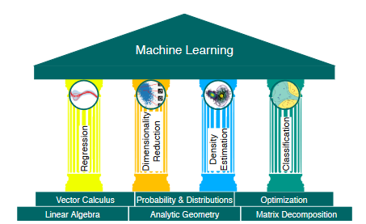

# AI Notes
This notes are all about AI.

I will call it AI even if it is not like that, it is not itelligence, it is just a simulation of it.

No one knows something until he do it, so let's learn how to create fake intelligence and how to use it.

I also like C/C++ and Verilog ;) but here we will use Python.

All start from this

